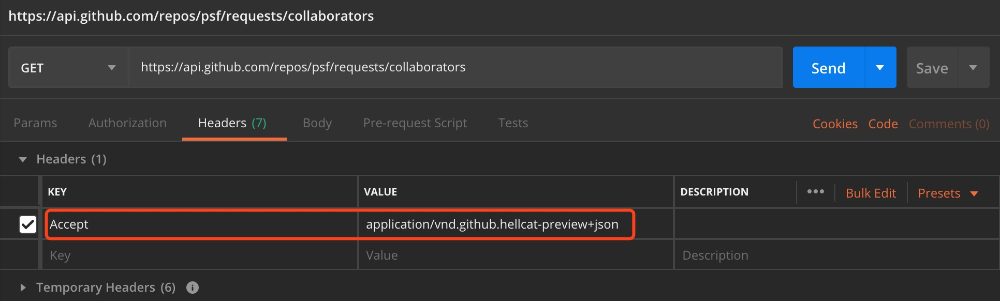
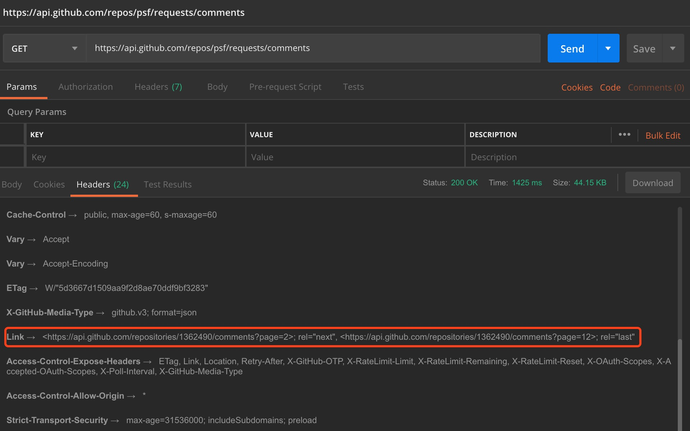
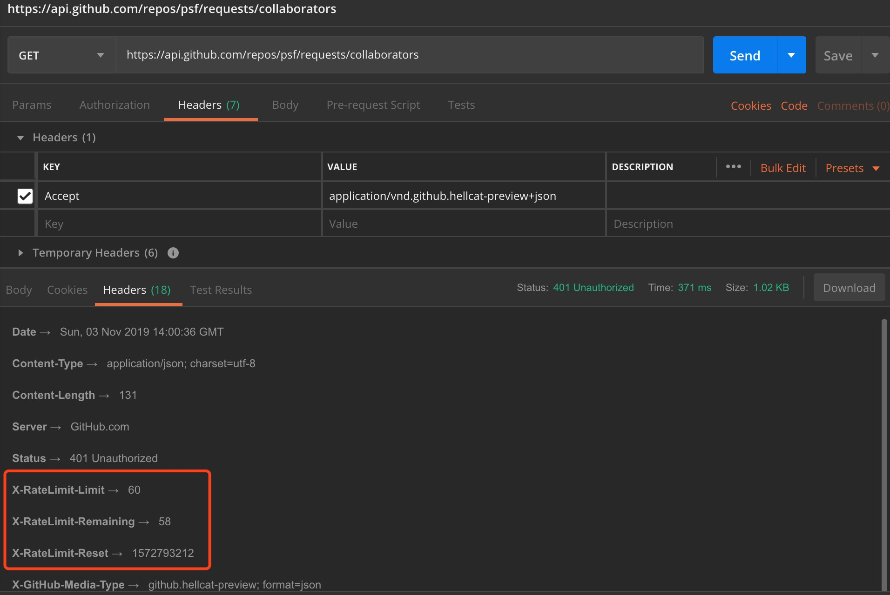
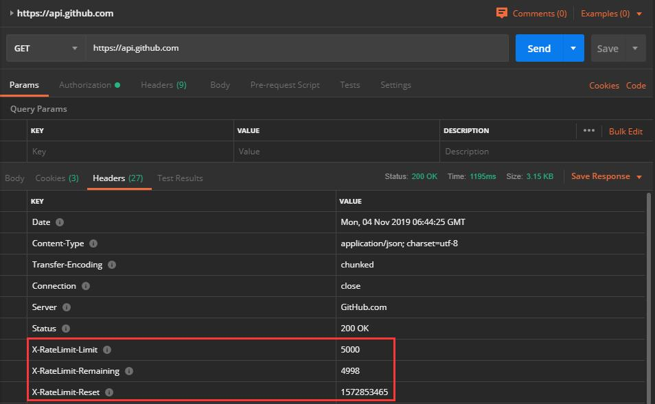

# web-application

數據科學開源工具第二次 presentation，利用 Python 寫一個獲取數據并分析數據的應用。

# 思路

1. 利用 requests 庫向 Github API 發請求
2. 獲取 requests 這個倉庫的各類信息，如 commit, issue, pull request, contributer, starer 等
3. 利用獲取的信息作圖并進行分析

# 工具

電腦系統：macOS/Windows 10

python 版本：3.7.4

編輯器：Visual Studio Code

版本管理工具：Git/GitKraken

請求工具：Postman

# 經驗總結

## 有部分接口需要指定 header

> To access the API, you must provide a custom media type in the Accept header

## 單個接口數據量太大

github 會通過 page 參數進行數據分頁處理，總頁數信息會放在響應的 header 中：

> Link: <https://api.github.com/user/repos?page=3&per_page=100>; rel="next",
>   <https://api.github.com/user/repos?page=50&per_page=100>; rel="last"

在請求某些大數據量的接口時，要先發送一次請求以獲取分頁信息，通過正則表達式提取頁數再進行下一次請求。

## 請求次數限制

github 會對未取得授權的請求進行限制，根據 IP 地址每小時只能請求 60 次。

取得授權后每小時可以請求 5000 次。

### 取得授權詳細操作

GitHub OAuth 2.0 授權流程如下：

> 1. A 网站让用户跳转到 GitHub。
> 2. GitHub 要求用户登录，然后询问"A 网站要求获得 xx 权限，你是否同意？"
> 3. 用户同意，GitHub 就会重定向回 A 网站，同时发回一个授权码。
> 4. A 网站使用授权码，向 GitHub 请求令牌。
> 5. GitHub 返回令牌.
> 6. A 网站使用令牌，向 GitHub 请求用户数据。

接下來是實現：

1. 先在[這個網址](https://github.com/settings/applications/new)註冊一個新的授權應用
2. 提交表單後到改應用的管理頁面取得 Client ID 和 Client Secret
3. 用任意後端語言寫一個簡單的 HTTP 服務器
4. 利用 Client ID 和 Callback URL 通過寫好的服務器發請求取得 Authorization Code
5. 再利用 Client ID、 Client Secret 和 Authorization Code 發請求取得 Access Token
6. 以後每次請求都在頭部加入 Access Token 即可

Postman 不能直接用上述取得的 Access Token，需要單獨請求一次授權。不過好在 Postman 已經做了授權功能，只需要填上對應的信息，並開啟服務器（以接收回調的 Authorization Code）即可自動取得 Access Token。

# 參考鏈接

[Github API docs](https://developer.github.com/v3/)

[requests repository](https://github.com/psf/requests)

[requests docs](https://requests.readthedocs.io)

[Google 开源项目 Python 风格规范](https://zh-google-styleguide.readthedocs.io/en/latest/google-python-styleguide/python_style_rules)

[GitHub OAuth 第三方登录示例教程](http://www.ruanyifeng.com/blog/2019/04/github-oauth.html)