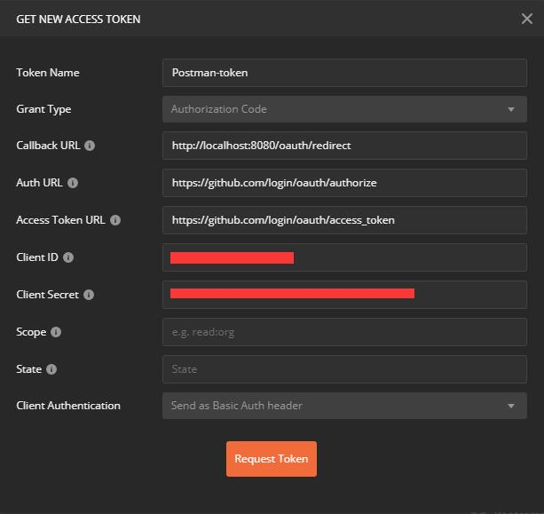
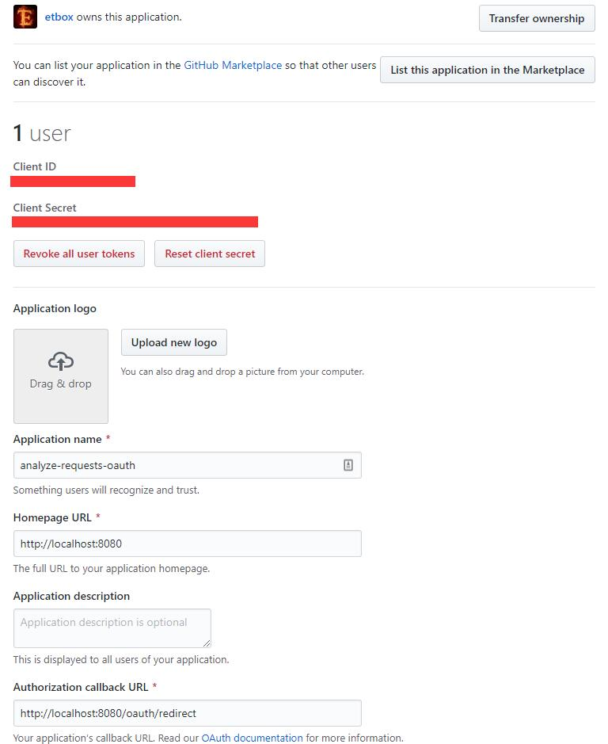
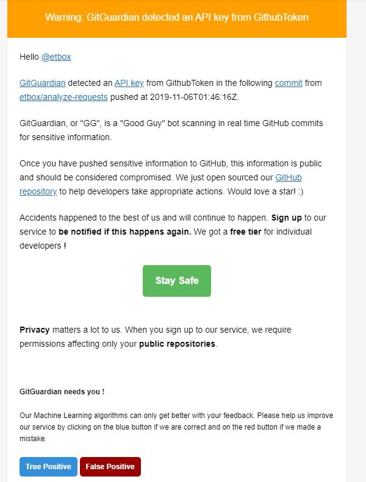

# web-application

數據科學開源工具第二次 presentation，利用 Python 寫一個獲取數據并分析數據的應用。

# 思路

1. 利用 requests 庫向 Github API 發請求
2. 獲取 requests 這個倉庫的各類信息，如 commit, issue, pull request, contributer, starer 等
3. 利用獲取的信息作圖并進行分析

# 工具

電腦系統：macOS/Windows 10

python 版本：3.7.4

編輯器：Visual Studio Code

版本管理工具：Git/GitKraken

請求工具：Postman

# 經驗總結

## 有部分接口需要指定 header

> To access the API, you must provide a custom media type in the Accept header

## 單個接口數據量太大

github 會通過 page 參數進行數據分頁處理，總頁數信息會放在響應的 header 中：

> Link: <https://api.github.com/user/repos?page=3&per_page=100>; rel="next",
>   <https://api.github.com/user/repos?page=50&per_page=100>; rel="last"

在請求某些大數據量的接口時，要先發送一次請求以獲取分頁信息，通過正則表達式提取頁數再進行下一次請求。
注意，後續的請求用循環比較好，因為便於 debug，遞歸難以 debug。

## 請求次數限制

github 會對未取得授權的請求進行限制，根據 IP 地址每小時只能請求 60 次。

取得授權后，根據授權取得的 Access Token 每小時可以請求 5000 次。

### 取得授權詳細操作

GitHub OAuth 2.0 授權流程如下：

> 1. A 网站让用户跳转到 GitHub。
> 2. GitHub 要求用户登录，然后询问"A 网站要求获得 xx 权限，你是否同意？"
> 3. 用户同意，GitHub 就会重定向回 A 网站，同时发回一个授权码。
> 4. A 网站使用授权码，向 GitHub 请求令牌。
> 5. GitHub 返回令牌.
> 6. A 网站使用令牌，向 GitHub 请求用户数据。

接下來是實現：

1. 先在[這個網址](https://github.com/settings/applications/new)註冊一個新的授權應用
2. 提交表單後到改應用的管理頁面取得 Client ID 和 Client Secret
3. 用任意後端語言寫一個簡單的 HTTP 服務器
4. 利用 Client ID 和 Callback URL 通過寫好的服務器發請求取得 Authorization Code
5. 再利用 Client ID、 Client Secret 和 Authorization Code 發請求取得 Access Token
6. 以後每次請求都在頭部加入 Access Token 即可

Postman 可以直接用上述取得的 Access Token 發請求，不過 Postman 也做了授權功能。
只需要填上對應的信息，並開啟服務器（以接收回調的 Authorization Code）即可自動取得新的 Access Token。

新的 Access Token 不會覆蓋先前的 Access Token，就像 Session ID 一樣，同一位用戶在多個瀏覽器都能保存登錄信息。
按說 Access Token 是隱私信息，不應寫死在代碼中，而應讓每個用戶生成自己的 Access Token。
~~本項目為減少額外工作量，將已經取得的 Access Token 寫死在代碼中。~~
由於 Github 的 Access Token 永不過期，必須手動吊銷 tokens，~~本項目所使用的 OAuth App 將於 2019/11/11 吊銷所有 tokens。~~

將 Access Token 推送到 Github 後，GitGuardian 發郵件警告我洩露了 Token。
於是立即 Revoke all user tokens，令 Github 上剛剛推送的 Access Token 失效。
萬幸的是服務器的代碼不需要更改，用戶只需重新授權即可。
為保證請求授權的代碼不洩露，在 Github 上新建一個私有倉庫，並將服務器代碼推送到該私有倉庫上。

# 參考鏈接

[Github API docs](https://developer.github.com/v3/)

[requests repository](https://github.com/psf/requests)

[requests docs](https://requests.readthedocs.io)

[Google 开源项目 Python 风格规范](https://zh-google-styleguide.readthedocs.io/en/latest/google-python-styleguide/python_style_rules)

[GitHub OAuth 第三方登录示例教程](http://www.ruanyifeng.com/blog/2019/04/github-oauth.html)

[APISecurityBestPractices](https://github.com/GitGuardian/APISecurityBestPractices)